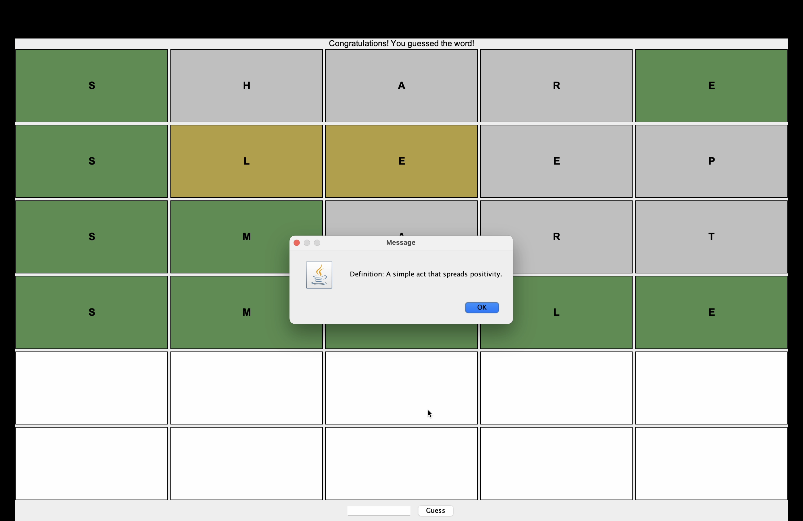

🎯 Wordle - Java GUI Game
A colorful Wordle game clone built using Java Swing!
Guess a 5-letter word in 6 tries. Each guess gives you visual feedback, just like the original game – plus, a cool popup with the word's definition at the end! 🧠✨

--------------------------------------------------------------

🖥️ Preview
✅ Correct Guess Example

❌ Game Over Example

--------------------------------------------------------------

💡 Game Features
* 🎨 GUI built using Java Swing

* 🟩 Green: correct letter in the correct spot

* 🟨 Yellow: letter is in the word but wrong spot

* ⬜ Grey: letter not in the word

* 📖 Shows the definition of the word at the end

* 🎮 6 attempts per game

* 😄 Simple, fun, and beginner-friendly

--------------------------------------------------------------

🛠️ Tech Stack

* Language: Java

* GUI: Java Swing

* No external libraries used

--------------------------------------------------------------

🚀 How to Run

1)Clone the repo:
  git clone https://github.com/g9shubh/Wordle.git
  cd Wordle

2)Compile the Java file:
  javac Wordle.java

3)Run the game:
  java Wordle

✅ Make sure your system has Java 8 or higher installed.

--------------------------------------------------------------

🎯 Learning Goals
This project is great for understanding:

Java Swing GUI

Layouts and grid systems

Conditional logic and feedback

Basic game mechanics

--------------------------------------------------------------

✍️ Author

Made with ❤️ by @g9shubh

--------------------------------------------------------------

📌 Note
This is a beginner-friendly Java project meant for fun and learning.
Great choice for practicing OOP, GUI, and logical thinking.
